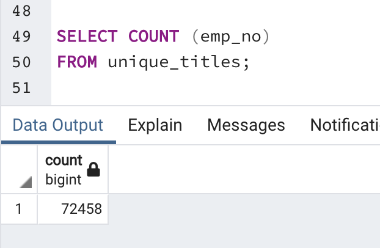
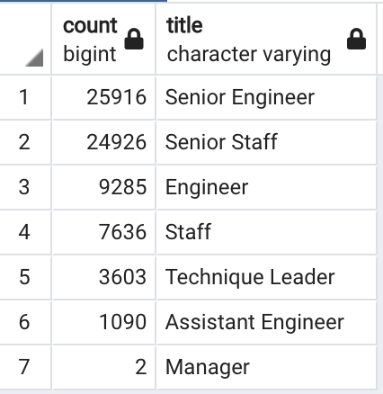
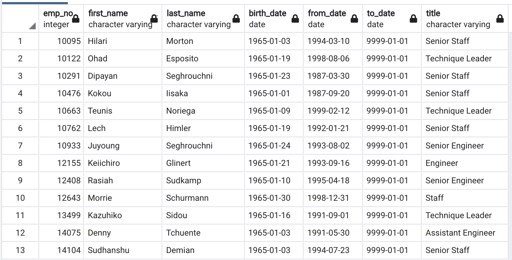
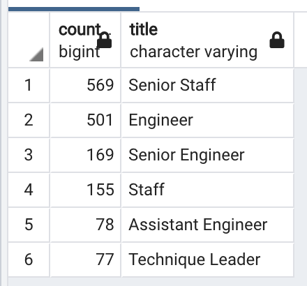

# Pewlett Hackard Employee Retirement Analysis

## Overview of the Analysis
The purpose of this analysis is to provide management with information on employees approaching retirement. A large number of employees reaching retirement age within a short span of time can severely impact a company negatively. The information provided by the analysis can help management prepare for vacancies in these positions by training employees to fill these roles in the near future and safeguard the company's future. 
The analysis exposes us as analysts to creating an SQL database by using pgAdmin to import and export CSV datasets. It is important for analysts to understand relationships between data and be able to write queries to obtain the certain information from various tables. 

## Results
Four major points from the two deliverables:
* In deliverable 1, we provided management with a list of all employees who are soon reaching retirement age (birth dates between 1/1/1952 and 12/31/1955) and their titles. Management can use the list `unique_titles` to determine which positions will vacant in the next few years and will need to be filled. 
* The list `unique_titles` contains over 72,000 employees. This is a lot of information for management to parse through. To give them a synopsis of the data, we also created the list `retiring_titles` that shows the count of employees retiring by title. From this list, management can easily see that the highest number of employees retiring are senior engineers and senior staff. Since these are senior positions, they are not easily replaceable. Management will need to make sure there are trained replacements able to fill these roles. 

**Total number of employees retiring as shown using `COUNT` to count the column `emp_no` in the `unique_titles` table**

**Table showing the total number of employees retiring by title. Found by using `COUNT` to count the `emp_no` column and `GROUP BY` to group data by title**

* In deliverable 2, we compiled a list of the employees eligible for the mentorship program in the `mentorship_eligibility`. The mentoring program intends to lessen the burden on the company by having such a large number of valuable employees retire at the same time. The mentorship program will have transition employees to a part-time role and allow them to mentor newly hired employees. 

* The `mentorship_eligibility` table shows the eligible employees' titles and the `from_date` shows how long they have held that role. This can give management insight into the employees' experience and an idea of whether they would be a good candidate to mentor other employees. 

**The `mentorship_eligibility` table shows all employees who are eligible to be mentors for other employees. It also shows their title and the date they received that title**

## Summary
* The "silver tsunami" will see a total of 72,458 positions that PH will need to fill. This is determined by using `COUNT` on the column containing employee numbers in the `unique_titles` table. To create the `unique_titles` table, we found all current employees who are eligible to retire by filtering birth dates between 1/1/1952 and 12/31/1955. We also used `DISTINCT ON` on the employee numbers to ensure we are not counting the same employee multiple times. The count of employees is reliable to show only the number of employees who are reaching retirement age and who are currently employed. 
* There are not as many employees eligible to be mentors than there are retiring. For example, there are 25,916 Senior Engineers retiring and only 169 Senior Engineers eligible to be mentors. This would mean each mentor would need about 150 mentees to replace all positions. Most eligible mentors are Senior Staff, but it's not likely that the 569 Senior Staff eligible to be mentors would be able to help mentor replacements for all of the 24,926 Senior Staff positions that will soon be vacant. Also, this list is limited in that it only shows employees eligible to become mentors. Not everyone who is eligible will want to take on the role. 

**Count of employees retiring by title**

**Count of employees eligible for mentorship by title**

An additional query that may be beneficial is to group the retiring and mentorship eligible employees by department. This will give management a better idea of the impact to each department the "silver tsunami" will have and can help department managers determine how many positions they will need to fill in the next few years. Department managers can also speak with employees eligible for the mentorship program about whether they would consider that option. This will also help management gauge the potential success of the program. 

Similar to how we created a second table to show the count of employees retiring by title in deliverable 1, the same would be beneficial to present to management for the employees eligible for mentorship. To answer the question of whether there were enough mentor eligible employees to help with upcoming employees, I created a table to the count of mentor-eligible employees per title. This helps to conceptualize a list of names and titles. 

